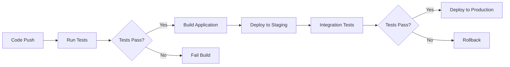
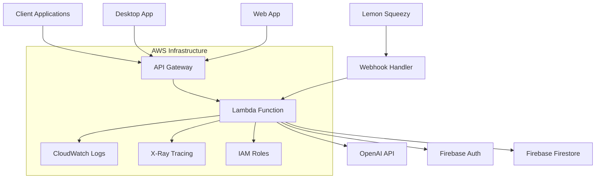

# Scizor - AI-Powered Productivity Platform

AI-Powered Productivity Platform (Scizor) - Developed and deployed a comprehensive full-stack productivity solution using modern cloud architecture. Built a NestJS backend with OpenAI GPT-4 integration deployed on AWS Lambda, implemented secure JWT authentication with Firebase, and created a PyQt6 desktop application with intelligent clipboard management and AI text enhancement. Architected serverless infrastructure using Terraform, implemented CI/CD pipelines with GitHub Actions, and integrated payment processing via Lemon Squeezy webhooks. The platform features global hotkeys, real-time AI text processing, and cross-platform compatibility, serving as a complete productivity solution for developers, content creators, and business professionals.

## 🚀 Overview

Scizor transforms your workflow with AI-powered productivity features, designed to streamline your daily tasks and enhance your creative output. This comprehensive platform combines the power of artificial intelligence with intuitive desktop automation to create a seamless productivity experience.

### 🎯 What is Scizor?

Scizor is an intelligent productivity suite that acts as your personal AI assistant, clipboard manager, note-taking companion, and text enhancement tool. Whether you're writing code, creating content, managing projects, or simply organizing your thoughts, Scizor provides the tools you need to work smarter, not harder.

### 🌟 Core Features

#### 📋 Smart Clipboard Management
- **Intelligent Organization**: Automatically categorizes and organizes clipboard content for easy retrieval
- **Smart History**: Maintains a 100-item history with duplicate prevention and intelligent deduplication
- **Instant Access**: One-click copying from history with global hotkey support
- **Search & Filter**: Quickly find specific clipboard items with intelligent search algorithms
- **Background Operation**: Silent monitoring that works across all applications without interference

#### 📝 Advanced Notes System
- **Persistent Storage**: SQLite database ensures your notes survive application restarts and system updates
- **CRUD Operations**: Full create, read, update, and delete functionality with auto-save capabilities
- **Priority System**: Organize notes with a 1-5 priority scale for effective task management
- **Inline Editing**: Direct editing within the interface for seamless note-taking
- **Search Functionality**: Powerful search capabilities to quickly locate specific notes
- **Offline Access**: All notes are stored locally, ensuring access even without internet connection

#### 🤖 AI-Powered Text Enhancement
- **GPT-4 Integration**: Leverages OpenAI's latest language model for intelligent text processing
- **7 Enhancement Types**: Choose from various enhancement styles including professional, creative, academic, and more
- **Smart Response Generation**: Context-aware AI responses for emails, messages, and content creation
- **Content Optimization**: Automatically improve clarity, tone, and effectiveness of your writing
- **Batch Processing**: Enhance multiple text selections simultaneously for increased efficiency

#### 🎧 Text-to-Speech & Reading
- **High-Quality Synthesis**: Convert any text to natural-sounding speech with multiple voice options
- **Reading Assistance**: Perfect for proofreading, accessibility, and content review
- **Voice Customization**: Adjust speed, pitch, and tone to match your preferences
- **Multi-Language Support**: Support for various languages and accents
- **Audio Export**: Save speech output as audio files for later use

#### 🌍 Translation & Language Tools
- **Multi-Language Translation**: Translate text between multiple languages with AI-powered accuracy
- **Context-Aware Translation**: Maintains meaning and tone across different languages
- **Real-Time Translation**: Instant translation results for quick communication
- **Language Detection**: Automatic detection of source language for seamless translation
- **Cultural Adaptation**: AI-powered cultural context preservation in translations

#### ⚙️ Comprehensive Settings & Configuration
- **50+ Configuration Options**: Extensive customization for every aspect of the application
- **Global Hotkeys**: Customizable keyboard shortcuts that work system-wide
- **Theme Customization**: Choose from multiple visual themes and color schemes
- **Performance Tuning**: Adjust clipboard monitoring frequency and resource usage
- **Backup & Sync**: Automatic backup of settings and data with cloud synchronization options
- **Import/Export**: Easy migration of settings between devices and installations

#### ⌨️ Global Hotkey System
- **System-Wide Access**: Hotkeys work across all applications and windows
- **Customizable Shortcuts**: Personalize hotkeys to match your workflow preferences
- **Quick Actions**: Instant access to clipboard history, notes, and AI features
- **Background Operation**: Hotkeys remain active even when the main interface is closed
- **Multi-Platform Support**: Consistent hotkey behavior across different operating systems

#### 🔒 Security & Privacy
- **Local Data Storage**: Your notes, clipboard history, and settings remain on your device
- **JWT Authentication**: Secure API access with automatic token refresh
- **PKCE Security**: Enhanced security for desktop applications with OAuth2 + PKCE flow
- **Encrypted Storage**: Secure handling of authentication tokens and sensitive data
- **No Cloud Dependencies**: Core features work offline without requiring internet connection
- **Privacy-First Design**: Your personal data never leaves your device unless explicitly shared

### 🎯 Who is Scizor For?

#### 👨‍💻 Developers & Programmers
- Enhance code comments and documentation with AI assistance
- Generate intelligent commit messages and pull request descriptions
- Quick text transformations and code snippet formatting
- Clipboard history for frequently used code patterns
- AI-powered coding assistance and problem-solving

#### ✍️ Writers & Content Creators
- Improve writing quality, clarity, and engagement
- Generate content ideas, outlines, and creative prompts
- Text enhancement for different audiences and platforms
- Quick note-taking and content organization
- Voice synthesis for content review and accessibility

#### 💼 Business Professionals
- Enhance emails and professional communication
- Generate meeting notes, summaries, and action items
- Quick access to frequently used text and templates
- Translation for international communication and collaboration
- Productivity automation with customizable hotkeys

#### 🎓 Students & Researchers
- Academic writing enhancement and improvement
- Research note organization and management
- Multi-language document translation
- Text-to-speech for study and review sessions
- Efficient information gathering and organization

### 🚀 Why Choose Scizor?

- **AI-Powered Intelligence**: Leverage the latest AI technology for enhanced productivity
- **Seamless Integration**: Works alongside your existing tools without disruption
- **Offline-First Design**: Core functionality available even without internet connection
- **Cross-Platform Compatibility**: Consistent experience across different operating systems
- **Enterprise-Grade Security**: Professional-grade authentication and data protection
- **Continuous Innovation**: Regular updates with new features and improvements
- **Community Support**: Active development and community-driven enhancements

## 📁 Project Architecture

```
Scizor/
├── backend/          # Node.js/NestJS backend services (AWS Lambda)
├── desktop/          # Python desktop application (Windows)
├── scizor-website/   # Next.js website and authentication portal
├── terraform/        # Infrastructure as Code (AWS)
└── docs/            # Comprehensive documentation
```

## 🗄️ Database Architecture

Scizor implements a hybrid database architecture optimized for different use cases:

### Desktop Application - SQLite Database
**Location**: `%APPDATA%\Scizor\scizor.db` (Windows)
**Technology**: SQLite3 with Python sqlite3 module
**Purpose**: Local data persistence and offline functionality

#### Database Schema
```sql
-- Notes Management
CREATE TABLE notes (
    id INTEGER PRIMARY KEY AUTOINCREMENT,
    title TEXT,
    content TEXT NOT NULL,
    priority INTEGER DEFAULT 1,
    created_at TEXT DEFAULT CURRENT_TIMESTAMP,
    updated_at TEXT DEFAULT CURRENT_TIMESTAMP
);

-- Clipboard History
CREATE TABLE clipboard_history (
    id INTEGER PRIMARY KEY AUTOINCREMENT,
    content TEXT NOT NULL,
    created_at TEXT DEFAULT CURRENT_TIMESTAMP,
    UNIQUE(content)
);

-- Application Settings
CREATE TABLE settings (
    id INTEGER PRIMARY KEY AUTOINCREMENT,
    setting_key TEXT UNIQUE NOT NULL,
    setting_value TEXT NOT NULL,
    created_at TEXT DEFAULT CURRENT_TIMESTAMP,
    updated_at TEXT DEFAULT CURRENT_TIMESTAMP
);

-- Authentication Tokens
CREATE TABLE auth_tokens (
    id INTEGER PRIMARY KEY AUTOINCREMENT,
    access_token TEXT NOT NULL,
    refresh_token TEXT NOT NULL,
    token_expiry INTEGER,
    created_at TEXT DEFAULT CURRENT_TIMESTAMP,
    updated_at TEXT DEFAULT CURRENT_TIMESTAMP
);
```

#### Key Features
- **Thread-Safe Connections**: Thread-local database connections for multi-threading
- **Automatic Initialization**: Self-creating database and tables on first run
- **Data Persistence**: Notes, clipboard history, and settings survive application restarts
- **Offline Operation**: Core functionality works without internet connection
- **Efficient Storage**: SQLite's lightweight footprint with ACID compliance

### Backend Services - Firebase Firestore
**Location**: Google Cloud Platform (Firebase Project)
**Technology**: Firebase Admin SDK with NestJS
**Purpose**: Cloud-based user management, authentication, and token tracking

#### Firestore Collections
```typescript
// User Token Management
collection('user_token') {
  user_id: string;           // Firebase Auth UID
  tokens: number;            // Available AI tokens
  is_premium: boolean;       // Subscription status
  subscription_id?: string;  // Lemon Squeezy subscription ID
  created_at: Timestamp;     // Account creation time
  updated_at: Timestamp;     // Last update time
}

// Text Processing History (Optional)
collection('text_processing') {
  user_id: string;           // User identifier
  operation_type: string;    // 'enhance', 'generate', 'tts', 'translate'
  input_text: string;        // Original text
  output_text: string;       // Processed result
  tokens_used: number;       // Cost of operation
  created_at: Timestamp;     // Processing timestamp
}
```

#### Key Features
- **Real-time Updates**: Firestore's live data synchronization
- **Scalable Architecture**: Automatic scaling for high-traffic applications
- **Security Rules**: Firebase Security Rules for data access control
- **Offline Support**: Client-side offline data persistence
- **Multi-region**: Global data distribution for low-latency access

#### Database Operations
- **User Authentication**: JWT token validation and user lookup
- **Token Management**: Deduct tokens for AI operations
- **Subscription Handling**: Premium user management and renewal
- **Payment Integration**: Lemon Squeezy webhook processing
- **User Lookup**: Email-to-UID mapping for payment processing

## 🔗 Database Integration Patterns

### Hybrid Architecture Benefits
- **Offline-First Desktop**: SQLite ensures core functionality without internet
- **Cloud-Scale Backend**: Firestore handles user management and scaling
- **Data Synchronization**: JWT tokens bridge local and cloud data
- **Performance Optimization**: Local storage for frequent operations, cloud for user data

### Data Flow Architecture
```
Desktop App (SQLite) ←→ JWT Authentication ←→ Backend (Firestore) ←→ Firebase Auth
     ↓                           ↓                    ↓
Local Data Storage        Secure API Access      User Management
- Notes & Clipboard      - AI Operations         - Token Tracking
- Settings               - Payment Processing    - Subscription Status
- Auth Tokens            - User Lookup           - Premium Features
```

### Security & Privacy
- **Local Data**: Notes, clipboard history, and settings remain on user's device
- **Cloud Data**: Only user authentication and token information stored remotely
- **Token-Based Access**: JWT tokens provide secure API access without storing sensitive data
- **Encrypted Communication**: All API calls use HTTPS with JWT validation

## 🏗️ Components

### Backend (`/backend`)
- **Technology**: Node.js, NestJS, TypeScript, AWS Lambda
- **Purpose**: AI proxy services, authentication, payment processing
- **Features**: 
  - OpenAI API integration (GPT-4, text-to-speech)
  - JWT authentication with Firebase

  - Serverless deployment on AWS Lambda
  - Rate limiting and security middleware
  - **Firestore Database**: User token management and subscription tracking
  - **Firebase Admin SDK**: Secure server-side authentication and user lookup
  - **Token Economy**: AI operation cost tracking and premium user management

### Desktop Application (`/desktop`)
- **Technology**: Python 3.8+, PyQt6, SQLite
- **Purpose**: Cross-platform productivity desktop application
- **Features**:
  - Smart clipboard history (auto-capture every 500ms)
  - AI-powered text enhancement and response generation
  - Global hotkey system (Ctrl+Alt+S, Ctrl+Alt+N, etc.)
  - Persistent notes with priority system
  - System tray integration and background operation
  - Advanced configuration with 50+ options
  - **SQLite Database**: Local data persistence for notes, clipboard, and settings
  - **Thread-Safe Database**: Multi-threaded clipboard monitoring with database connections
  - **Offline-First Design**: Core functionality works without internet connection
  - **Automatic Data Management**: Self-initializing database with automatic table creation

### Website (`/scizor-website`)
- **Technology**: Next.js 14, React 19, TypeScript, Tailwind CSS
- **Purpose**: Marketing website and authentication portal
- **Features**:
  - Modern landing page with feature showcase
  - Firebase authentication integration
  - Device authorization flow for desktop app
  - Pricing page with Lemon Squeezy integration
  - Responsive design and optimized performance

## 🧪 Testing & Quality Assurance

### Testing Strategy

Scizor implements a comprehensive multi-layered testing approach to ensure code quality and reliability:

#### Backend Testing (NestJS)
- **Unit Tests**: Jest-based testing with `npm test`
  - Individual component testing in isolation
  - Mock external dependencies (OpenAI, Firebase)
  - Business logic validation and error handling
  - Target: >80% code coverage
  

#### Desktop Application Testing (Python)
- **Test Framework**: PyTest with comprehensive test suite
- **Test Categories**:
  - `test_hotkey_enhance.py` - Hotkey functionality validation
  - `test_device_auth.py` - Authentication flow testing
  - `test_clipboard_functionality.py` - Clipboard operations
  - `test_notes.py` - Notes system functionality
  - `test_popup.py` - UI popup behavior
  - `test_settings.py` - Configuration management
  
- **Test Execution**:
  ```bash
  # Run all tests
  python -m pytest tests/
  
  # Run specific test file
  python tests/test_hotkey_enhance.py
  
  # Run with coverage
  python -m pytest tests/ --cov=src --cov-report=html
  ```

## 🔄 CI/CD Pipeline

### GitHub Actions Workflows

Scizor uses GitHub Actions for automated testing, building, and deployment:

#### Backend Testing Workflow (`.github/workflows/backend-tests.yml`)
```yaml
name: Backend Tests
on:
  push:
    branches: [master]
    paths: ['backend/**']
  pull_request:
    branches: [master]
    paths: ['backend/**']

jobs:
  test:
    runs-on: ubuntu-latest
    steps:
      - name: Checkout code
        uses: actions/checkout@v4
      - name: Install dependencies
        working-directory: ./backend
        run: npm i
      - name: Run tests
        working-directory: ./backend
        run: npm test
```

#### Planned CI/CD Enhancements
- **Automated Deployment**: AWS Lambda deployment after successful tests
- **Infrastructure Testing**: Terraform plan validation
- **Security Scanning**: Automated vulnerability detection
- **Performance Monitoring**: API response time tracking
- **Multi-environment**: Staging and production deployment pipelines

### Deployment Pipeline



## 💳 Payment Implementation

### Lemon Squeezy Integration

Scizor uses Lemon Squeezy for subscription management and payment processing:

#### Webhook Architecture
- **Unified Endpoint**: `POST /payment/subscription` handles all events
- **Event Types**: 
  - `subscription_created` - New subscription activation
  - `subscription_updated` - Plan modifications
  - `subscription_cancelled` - Subscription termination
  - `subscription_payment_success` - Monthly renewals
  - `subscription_payment_failed` - Payment failures

#### Security Features
- **HMAC-SHA256 Signature Validation**: Webhook authenticity verification
- **Environment-based Secrets**: Secure webhook secret storage
- **Payload Validation**: Comprehensive request structure validation
- **User Lookup**: Email-based user identification fallback

#### Product Configuration
```typescript
private readonly PRODUCT_CONFIG = {
  PREMIUM_PRODUCT_ID: process.env.LEMON_SQUEEZY_PRO_PRODUCT_ID,
  FREE_PRODUCT_ID: process.env.LEMON_SQUEEZY_STANDARD_PRODUCT_ID
};
```

#### Subscription Flow
1. **User Selection**: Choose plan on website
2. **Checkout Creation**: Lemon Squeezy checkout with user ID
3. **Payment Processing**: Secure payment handling
4. **Webhook Notification**: Real-time subscription updates
5. **User Upgrade**: Automatic token allocation and status update

#### API Endpoints
- `POST /payment/subscription` - Main webhook handler
- `POST /payment/monthly-renew` - Bulk token renewal
- `POST /payment/return-to-free` - Downgrade endpoint (legacy)

### Token Management

- **Free Tier**: 20 tokens per month
- **Premium Tier**: 500 tokens per month
- **Automatic Renewal**: Monthly token refresh for active subscribers
- **Usage Tracking**: Real-time token consumption monitoring
- **Grace Period**: Extended access for failed payments

## 📦 Desktop Application Installer

### Inno Setup Configuration

Scizor Desktop uses Inno Setup for professional Windows installation:

#### Installer Features (`desktop/installer/scizor_desktop_setup.iss`)
- **Modern Wizard Interface**: Professional installation experience
- **Automatic Updates**: Seamless upgrade handling
- **System Integration**: Start menu, desktop shortcuts, startup options
- **Registry Management**: Proper Windows registry configuration
- **Uninstall Support**: Clean removal with registry cleanup

#### Installation Options
```ini
[Tasks]
Name: "desktopicon"; Description: "Create Desktop Icon"
Name: "startup"; Description: "Start with Windows"
Name: "quicklaunchicon"; Description: "Quick Launch Icon"
```

#### System Requirements
- **OS**: Windows 10/11 (64-bit)
- **Architecture**: x64 only
- **Privileges**: Standard user installation (no admin required)
- **Dependencies**: Visual C++ Redistributable (auto-installed)

### Build Process

#### Automated Build Script (`desktop/build_installer.py`)
```python
class ScizorBuilder:
    def build_executable(self):
        """Build executable using PyInstaller"""
        # Create version info
        # Handle icon conversion
        # Execute PyInstaller build
        
    def create_installer(self):
        """Create Windows installer package"""
        # Run Inno Setup compiler
        # Package all dependencies
        # Generate final installer
```

#### Build Steps
1. **Dependency Check**: Verify PyInstaller and Inno Setup
2. **Clean Build**: Remove previous artifacts
3. **Executable Build**: PyInstaller compilation
4. **Icon Conversion**: PNG to ICO format conversion
5. **Installer Creation**: Inno Setup package generation
6. **Output Packaging**: Final installer and distribution files

#### Build Commands
```bash
# Full build process
python build_installer.py

# Manual build steps
pyinstaller --onefile --windowed src/main.py
iscc installer/scizor_desktop_setup.iss
```

### Distribution

#### Installer Output
- **Primary Installer**: `ScizorDesktopSetup.exe`
- **Portable Version**: `ScizorDesktop.exe` (standalone)
- **Resource Files**: Icons, documentation, and assets
- **Dependencies**: All required Python libraries bundled

#### Installation Locations
- **Default Directory**: `{autopf}\Scizor Desktop`
- **User Data**: `{userappdata}\Scizor Desktop`
- **Registry Keys**: `HKCU\Software\Microsoft\Windows\CurrentVersion\Run`

## 🔧 Technology Stack

### Backend Services
- **Framework**: NestJS with TypeScript
- **Runtime**: Node.js 18+ on AWS Lambda
- **Database**: Firebase Firestore with Firebase Admin SDK
- **AI**: OpenAI GPT-4, text-to-speech APIs
- **Authentication**: JWT with Firebase Auth
- **Infrastructure**: AWS (Lambda, API Gateway, IAM)
- **Deployment**: Terraform Infrastructure as Code
- **Data Persistence**: Firestore collections for user management and token tracking

### Desktop Application
- **Language**: Python 3.8+
- **GUI Framework**: PyQt6
- **Database**: SQLite3 with thread-safe connections
- **HTTP Client**: Requests library
- **System Integration**: pywin32, keyboard, pyperclip
- **Packaging**: PyInstaller for Windows executable
- **Data Management**: Automatic database initialization and table creation
- **Storage Location**: User-specific database in %APPDATA%\Scizor\

### Web Frontend
- **Framework**: Next.js 14 with App Router
- **Language**: TypeScript
- **Styling**: Tailwind CSS v4
- **Authentication**: Firebase Auth
- **Payment**: Lemon Squeezy integration
- **Deployment**: Optimized for Vercel

## 🚀 Getting Started

### Prerequisites
- **Node.js** (v18 or higher)
- **Python** (v3.8 or higher)
- **Git** for version control
- **AWS Account** (for deployment)
- **Firebase Project** (for authentication)
- **OpenAI API Key** (for AI features)

### Backend Setup
```bash
cd backend

# Install dependencies
npm install

# Set environment variables
cp .env.example .env
# Edit .env with your API keys and secrets

# Development mode
npm run dev

# Build for production
npm run build

# Deploy to AWS (requires Terraform setup)
npm run deploy
```

### Desktop Application Setup
```bash
cd desktop

# Create virtual environment
python -m venv venv

# Activate virtual environment
# On Windows:
venv\Scripts\activate
# On macOS/Linux:
source venv/bin/activate

# Install dependencies
pip install -r requirements.txt

# Run the application
python src/main.py

# Build executable (Windows)
python build_installer.py
```

### Website Setup
```bash
cd scizor-website

# Install dependencies
npm install

# Set environment variables
cp .env.example .env.local
# Configure Firebase and other services

# Development mode
npm run dev

# Build for production
npm run build
npm run start
```

## 🔐 Authentication Flow

Scizor uses a secure JWT-based authentication system with PKCE (Proof Key for Code Exchange) for desktop applications:

### 1. Website Authorization (OAuth2 + PKCE)
```
User → Website (/auth/device) → Email/Google Login → Consent Page → JWT Token
```

### 2. Desktop Token Exchange
```
Desktop App → Receives Consent Token → Exchanges for Access/Refresh Tokens → Authenticated API Calls
```

### 3. API Request Authentication
All AI endpoints require JWT authentication:
```
Authorization: Bearer <access_token>
Content-Type: application/json
```

### Key Security Features
- **PKCE Protection**: Prevents authorization code interception
- **JWT Tokens**: Secure, stateless authentication
- **Token Refresh**: Automatic token renewal without re-authentication
- **Scope Control**: Granular permission management

## 🏗️ Infrastructure & Deployment

### AWS Cloud Architecture

Scizor's backend is built on AWS serverless architecture, providing scalable, cost-effective, and highly available services:

#### Core AWS Services

**AWS Lambda (Serverless Compute)**
- **Runtime**: Node.js 18.x with NestJS framework
- **Memory**: 1024 MB allocated for AI operations
- **Timeout**: 30 seconds for complex AI processing
- **Scaling**: Automatic scaling from 0 to thousands of concurrent executions
- **Cost**: Pay-per-request pricing model

**API Gateway (REST API Management)**
- **Type**: REST API with Lambda proxy integration
- **Authentication**: JWT-based security at application level
- **CORS**: Cross-origin resource sharing enabled for web applications
- **Binary Support**: Audio media types for text-to-speech responses
- **Stages**: Production deployment with automatic versioning

**IAM (Identity & Access Management)**
- **Lambda Execution Role**: Least-privilege access policy
- **CloudWatch Logs**: Automatic logging and monitoring
- **X-Ray Tracing**: Distributed tracing for performance monitoring
- **Security**: Service-to-service authentication and authorization

### Terraform Infrastructure as Code

Scizor uses Terraform for declarative infrastructure management, ensuring reproducible and version-controlled deployments:

#### Terraform Configuration Structure

```
backend/terraform/
├── main.tf              # Main entry point and module organization
├── providers.tf         # AWS provider configuration
├── variables.tf         # Input variables and configuration
├── lambda.tf           # Lambda function and packaging
├── api_gateway.tf      # API Gateway and endpoint configuration
├── iam.tf              # IAM roles and policies
├── outputs.tf          # Deployment outputs and endpoints
└── terraform.tfvars    # Environment-specific values
```

#### Key Terraform Resources

**Lambda Function Configuration**
```hcl
resource "aws_lambda_function" "scizor_ai_lambda" {
  function_name    = "scizor-ai-backend"
  handler          = "lambda.handler"
  runtime          = "nodejs18.x"
  memory_size      = 1024
  timeout          = 30
  
  environment {
    variables = {
      NODE_ENV                    = "production"
      OPENAI_API_KEY             = var.openai_api_key
      FIREBASE_PROJECT_ID        = var.firebase_project_id
      JWT_SECRET                 = var.jwt_secret
      # ... additional environment variables
    }
  }
}
```

**API Gateway Endpoint Structure**
```hcl
locals {
  endpoints = {
    "enhance-prompt"     = { method = "POST", require_auth = true }
    "generate-response"  = { method = "POST", require_auth = true }
    "text-to-speech"    = { method = "POST", require_auth = true }
    "translate"          = { method = "POST", require_auth = true }
    "health"             = { method = "GET", require_auth = false }
  }
}
```

**IAM Security Policies**
```hcl
resource "aws_iam_role" "lambda_exec_role" {
  name = "scizor-ai-lambda-execution-role"
  
  assume_role_policy = jsonencode({
    Version = "2012-10-17"
    Statement = [{
      Action = "sts:AssumeRole"
      Effect = "Allow"
      Principal = { Service = "lambda.amazonaws.com" }
    }]
  })
}
```

#### Infrastructure Deployment Process

**1. Environment Setup**
```bash
# Initialize Terraform working directory
cd backend/terraform
terraform init

# Configure environment variables
cp terraform.tfvars.example terraform.tfvars
# Edit terraform.tfvars with your values
```

**2. Deployment Planning**
```bash
# Preview infrastructure changes
terraform plan -out=tfplan

# Review the planned changes
terraform show tfplan
```

**3. Infrastructure Deployment**
```bash
# Apply the infrastructure changes
terraform apply tfplan

# Or apply directly
terraform apply
```

**4. Verification and Monitoring**
```bash
# Check deployment outputs
terraform output

# Verify Lambda function
aws lambda get-function --function-name scizor-ai-backend

# Test API endpoints
curl https://your-api-gateway-url/ai/health
```

#### Infrastructure Variables

**Required Variables**
```hcl
variable "openai_api_key" {
  description = "OpenAI API Key for AI operations"
  type        = string
  sensitive   = true
}

variable "firebase_project_id" {
  description = "Firebase Project ID for authentication"
  type        = string
}

variable "jwt_secret" {
  description = "JWT secret key (minimum 32 characters)"
  type        = string
  sensitive   = true
}

variable "lemon_squeezy_webhook_secret" {
  description = "Webhook signature validation secret"
  type        = string
  sensitive   = true
}
```

### Deployment Architecture

#### Serverless Application Structure



#### Security Architecture

**Authentication Flow**
1. **JWT Validation**: All AI endpoints require valid JWT tokens
2. **Token Verification**: Firebase-based user authentication
3. **Request Authorization**: Role-based access control
4. **API Security**: HTTPS-only communication with API Gateway

**Security Features**
- **Environment Variables**: Sensitive data stored securely in Lambda
- **IAM Policies**: Least-privilege access to AWS services
- **Webhook Validation**: HMAC-SHA256 signature verification
- **CORS Protection**: Controlled cross-origin access
- **Binary Security**: Safe handling of audio and file uploads

#### Performance Optimization

**Lambda Configuration**
- **Memory Allocation**: 1024 MB for optimal AI processing
- **Timeout Settings**: 30 seconds for complex operations
- **Cold Start Mitigation**: Provisioned concurrency options
- **Resource Optimization**: Efficient dependency packaging

**API Gateway Optimization**
- **Caching**: Response caching for static content
- **Compression**: Automatic response compression
- **Throttling**: Rate limiting and request throttling
- **Monitoring**: Real-time performance metrics

### Monitoring and Observability

#### CloudWatch Integration

**Logging Strategy**
- **Structured Logging**: JSON-formatted log entries
- **Log Levels**: Debug, Info, Warn, Error categorization
- **Log Retention**: Configurable log retention policies
- **Log Analysis**: CloudWatch Insights for querying logs

**Metrics and Alarms**
- **Lambda Metrics**: Invocation count, duration, errors
- **API Gateway Metrics**: Request count, latency, 4xx/5xx errors
- **Custom Metrics**: Business-specific performance indicators
- **Automated Alerts**: Proactive failure notification

#### X-Ray Distributed Tracing

**Tracing Benefits**
- **Request Flow**: End-to-end request visualization
- **Performance Analysis**: Bottleneck identification
- **Service Dependencies**: Map of service interactions
- **Error Diagnosis**: Root cause analysis for failures

**Trace Configuration**
```hcl
resource "aws_iam_role_policy" "lambda_logging_policy" {
  policy = jsonencode({
    Statement = [{
      Effect = "Allow"
      Action = [
        "xray:PutTraceSegments",
        "xray:PutTelemetryRecords"
      ]
      Resource = "*"
    }]
  })
}
```

#### Business Continuity

**Recovery Procedures**
1. **Infrastructure Recovery**: Terraform-based redeployment
2. **Application Recovery**: Lambda function restoration
3. **Data Recovery**: Firebase backup and restore
4. **Service Validation**: Automated health checks

**Monitoring and Alerting**
- **Health Checks**: Automated endpoint monitoring
- **Performance Baselines**: Normal operation metrics
- **Alert Escalation**: Automated notification workflows
- **Incident Response**: Documented recovery procedures


### Deployment Process

```bash
# Infrastructure deployment
cd backend/terraform
terraform init
terraform plan
terraform apply

# Application deployment (automated via Terraform)
npm run build  # Builds and packages for Lambda
```

### Environment Configuration
Required environment variables:
- `OPENAI_API_KEY`: OpenAI API access
- `FIREBASE_PROJECT_ID`: Firebase project identifier
- `FIREBASE_CLIENT_EMAIL`: Service account email
- `FIREBASE_PRIVATE_KEY`: Service account private key
- `JWT_SECRET`: Token signing secret (32+ characters)
- `LEMON_SQUEEZY_WEBHOOK_SECRET`: Webhook signature validation
- `LEMON_SQUEEZY_PRO_PRODUCT_ID`: Premium product identifier
- `LEMON_SQUEEZY_STANDARD_PRODUCT_ID`: Free tier product identifier

#### Database Configuration
- **Firestore**: Automatically configured via Firebase Admin SDK credentials
- **SQLite**: Desktop app automatically creates database in user's AppData directory
- **Connection Pooling**: Backend uses Firebase Admin SDK connection management
- **Local Storage**: Desktop app uses thread-safe SQLite connections with automatic cleanup

## 💰 Pricing & Subscription

Scizor offers flexible pricing tiers:

### Free Tier
- **Tokens**: 20 per month
- **Features**: Basic clipboard, limited AI enhancements
- **Notes**: Unlimited local storage

### Premium Tier  
- **Tokens**: 500 per month
- **Features**: Full AI capabilities, text-to-speech, translation
- **Payment**: Managed via Lemon Squeezy integration
- **Renewal**: Automatic monthly token refresh

## 🔧 Development

### Backend Development
```bash
# Testing
npm test                    # Unit tests
npm run test:e2e           # End-to-end tests
npm run test:cov           # Coverage report

# Code Quality
npm run lint               # ESLint
npm run format             # Prettier formatting

# Development
npm run dev                # Watch mode
npm run start:debug        # Debug mode
```

### Desktop Development
```bash
# Testing
python -m pytest tests/              # Run test suite
python tests/test_hotkey_enhance.py  # Specific tests

# Code Quality
black src/                 # Code formatting
flake8 src/               # Linting

# Development
python src/main.py        # Standard mode
python tests/test_hotkey_fixed.py  # Test mode

# Database Management
# Database is automatically created in %APPDATA%\Scizor\scizor.db
# Tables are auto-initialized on first run
# Use SQLite browser tools for manual database inspection
```

### Database Development
```bash
# Backend Database (Firestore)
# Collections are automatically created on first document write
# Use Firebase Console for manual data inspection and management

# Desktop Database (SQLite)
# Database location: %APPDATA%\Scizor\scizor.db
# Tables: notes, clipboard_history, settings, auth_tokens
# Automatic initialization and migration handling
```

### Website Development
```bash
# Development
npm run dev               # Development server
npm run build             # Production build
npm run lint              # Next.js linting
npm run type-check        # TypeScript checking
```

## 📋 Key Features

### 🤖 AI-Powered Features
- **Prompt Enhancement**: GPT-4 powered text improvement with 7 enhancement types
- **Smart Response Generation**: Context-aware AI responses for various scenarios
- **Text-to-Speech**: High-quality voice synthesis with multiple voices
- **Translation**: Multi-language translation support
- **Content Analysis**: Intelligent text processing and optimization

### 📋 Clipboard Management
- **Auto-Capture**: Monitor clipboard changes every 500ms
- **Smart History**: 15-item history with duplicate prevention
- **Instant Access**: One-click copying from history
- **Search & Filter**: Find clipboard items quickly
- **Background Operation**: Silent monitoring without interference

### 📝 Notes System
- **Persistent Storage**: SQLite database for reliable data storage
- **CRUD Operations**: Create, read, update, delete with auto-save
- **Priority System**: 1-5 scale organization system
- **Inline Editing**: Direct editing in the interface
- **Search Functionality**: Quick note discovery

### ⌨️ Global Hotkeys
- **Dashboard Toggle**: `Ctrl+Alt+S` - Show/hide main interface
- **Quick Notes**: `Ctrl+Alt+N` - Create note from selected text
- **AI Enhancement**: `Ctrl+Alt+H` - Enhance selected text
- **Smart Response**: `Ctrl+Alt+G` - Generate AI response
- **System-Wide**: Works across all applications

### 🔒 Security & Privacy
- **Local Storage**: Notes and clipboard data stored locally only
- **JWT Authentication**: Secure API access with token refresh
- **PKCE Flow**: Enhanced security for desktop applications
- **No Cloud Dependencies**: Core features work offline
- **Encrypted Storage**: Secure handling of authentication tokens

## 🎯 Use Cases

### For Developers
- Enhance code comments and documentation
- Generate intelligent commit messages
- Quick text transformations and formatting
- Clipboard history for code snippets
- AI-powered coding assistance

### For Writers & Content Creators
- Improve writing quality and clarity
- Generate content ideas and outlines
- Text enhancement for different audiences
- Quick note-taking and organization
- Voice synthesis for content review

### For Business Professionals
- Enhance emails and professional communication
- Generate meeting notes and summaries
- Quick access to frequently used text
- Translation for international communication
- Productivity automation with hotkeys

## 📊 System Requirements

### Desktop Application
- **OS**: Windows 10/11 (64-bit)
- **RAM**: 4 GB minimum (8 GB recommended)
- **Storage**: 500 MB disk space
- **Network**: Internet connection for AI features
- **Python**: 3.8+ (for development)

### Development Environment
- **Node.js**: v18 or higher
- **Python**: v3.8 or higher
- **Git**: Latest version
- **AWS CLI**: For deployment (optional)
- **Terraform**: v1.0+ for infrastructure

## 🚀 Quick Start

### 1. Clone Repository
```bash
git clone https://github.com/your-username/scizor.git
cd scizor
```

### 2. Setup Backend
```bash
cd backend
npm install
cp .env.example .env
# Configure environment variables
npm run dev
```

### 3. Setup Desktop App
```bash
cd ../desktop
python -m venv venv
venv\Scripts\activate  # Windows
pip install -r requirements.txt
python src/main.py
```

### 4. Access Features
- Use `Ctrl+Alt+S` to toggle the dashboard
- Configure hotkeys in settings
- Authenticate for AI features
- Start enhancing your productivity!

## 🔄 API Endpoints

### AI Services
- `POST /ai/enhance-prompt` - Enhance text prompts
- `POST /ai/generate-response` - Generate AI responses  
- `POST /ai/text-to-speech` - Convert text to speech
- `POST /ai/translate` - Translate text

### Authentication
- `POST /auth/device/token` - Exchange consent token
- `POST /auth/create-user-token` - Create user tokens
- `GET /auth/device` - Device authorization

### Payment
- `POST /payment/subscription` - Unified Lemon Squeezy webhook
- `POST /payment/monthly-renew` - Process renewals
- `POST /payment/return-to-free` - Downgrade to free

## 📚 Documentation

- [Backend API Documentation](backend/docs/API_DOCUMENTATION.md)
- [Desktop Application Guide](desktop/docs/)
- [Authentication Flow](JWT_AUTHENTICATION_FLOW_FIXED.md)
- [Deployment Guide](backend/terraform/README.md)
- [Lemon Squeezy Integration](backend/docs/LEMON_SQUEEZY_WEBHOOK_SETUP.md)
- [Contributing Guidelines](CONTRIBUTING.md)

## 🤝 Contributing

We welcome contributions! Please follow these steps:

1. **Fork** the repository
2. **Create** a feature branch (`git checkout -b feature/amazing-feature`)
3. **Commit** your changes (`git commit -m 'Add amazing feature'`)
4. **Push** to the branch (`git push origin feature/amazing-feature`)
5. **Open** a Pull Request

### Development Guidelines
- Follow existing code style and conventions
- Add tests for new functionality
- Update documentation as needed
- Ensure all tests pass before submitting

## 📄 License

This project is licensed under the [MIT License](LICENSE) - see the LICENSE file for details.

## 🆘 Support & Community

- **GitHub Issues**: [Report bugs and request features](https://github.com/your-username/scizor/issues)
- **Documentation**: [Comprehensive guides and API docs](docs/)
- **Email Support**: support@scizor.com
- **Community**: Join our community discussions

## 🙏 Acknowledgments

- OpenAI for GPT-4 and AI services
- Firebase for authentication infrastructure
- AWS for reliable cloud hosting
- PyQt6 for desktop application framework
- Next.js team for the excellent web framework
- Lemon Squeezy for payment processing
- Inno Setup for professional Windows installation

---

**Built with ❤️ by [Shaked Shoshan](https://github.com/shakedshoshan)**

*Scizor - Enhancing productivity through intelligent automation* 
