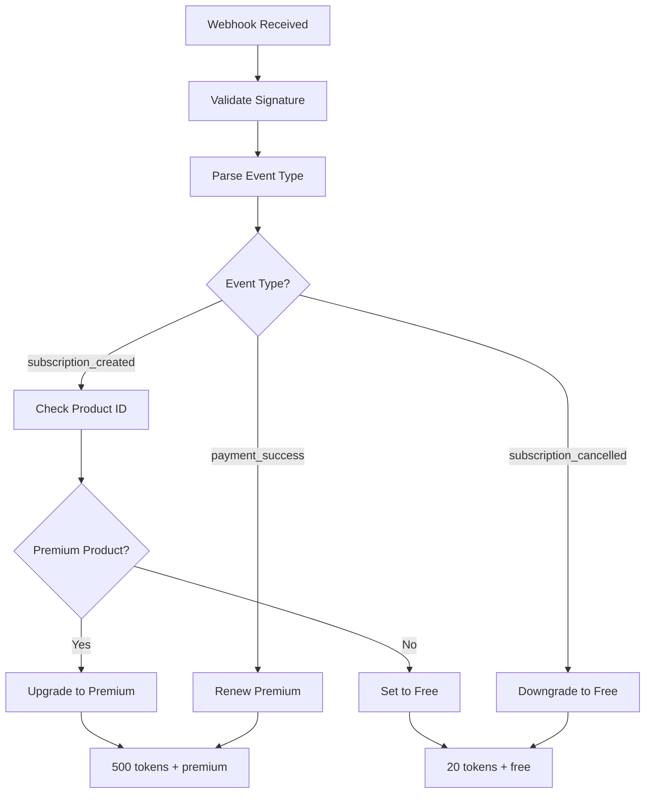

# Lemon Squeezy Webhook Integration Setup

This document explains how to set up and use the unified Lemon Squeezy webhook integration for payment handling.

## Overview

The payment system has been updated to use a single webhook endpoint (`/payment/subscription`) that handles all Lemon Squeezy subscription events. This replaces the previous separate endpoints.

## Architecture

### Key Components

1. **Unified Webhook Endpoint**: `POST /payment/webhook`
2. **Event Processing**: Handles subscription lifecycle events
3. **Product Mapping**: Maps Lemon Squeezy products to user tiers
4. **Signature Validation**: Ensures webhook authenticity

### Supported Events

- `subscription_created` - New subscription activated
- `subscription_updated` - Subscription modified
- `subscription_cancelled` - Subscription cancelled
- `subscription_expired` - Subscription expired
- `subscription_paused` - Subscription paused
- `subscription_resumed` - Subscription resumed
- `subscription_unpaused` - Subscription unpaused
- `subscription_payment_success` - Payment successful
- `subscription_payment_failed` - Payment failed
- `subscription_payment_recovered` - Failed payment recovered

## Setup Instructions

### 1. Environment Variables

Add these environment variables to your `.env` file:

```bash
# Lemon Squeezy Configuration
LEMON_SQUEEZY_WEBHOOK_SECRET=your_webhook_secret_here
LEMON_SQUEEZY_PRO_PRODUCT_ID=your_premium_product_id
LEMON_SQUEEZY_STANDARD_PRODUCT_ID=your_standard_product_id
```

### 2. Lemon Squeezy Dashboard Setup

1. Go to **Settings → Webhooks** in your Lemon Squeezy dashboard
2. Click the **plus icon** to create a new webhook
3. Set the endpoint URL to: `https://yourdomain.com/payment/subscription`
4. Add a signing secret (save this as `LEMON_SQUEEZY_WEBHOOK_SECRET`)
5. Select these events:
   - `subscription_created`
   - `subscription_updated`
   - `subscription_cancelled`
   - `subscription_expired`
   - `subscription_paused`
   - `subscription_resumed`
   - `subscription_unpaused`
   - `subscription_payment_success`
   - `subscription_payment_failed`
   - `subscription_payment_recovered`

### 3. Product Configuration

Update the product IDs in your environment variables:

- `LEMON_SQUEEZY_PRO_PRODUCT_ID`: Your premium subscription product ID
- `LEMON_SQUEEZY_STANDARD_PRODUCT_ID`: Your standard tier product ID

### 4. Custom Data Setup

When creating checkouts in Lemon Squeezy, include the user ID in custom data:

```javascript
// Example checkout creation
{
  "data": {
    "type": "checkouts",
    "attributes": {
      "product_options": {
        "redirect_url": "https://yourdomain.com/success"
      },
      "checkout_data": {
        "email": "user@example.com",
        "custom": {
          "user_id": "user_123" // Include your user ID here
        }
      }
    }
  }
}
```

## How It Works

### Subscription Flow

1. **User subscribes** → `subscription_created` webhook sent
2. **System processes** → Checks product ID and updates user:
   - Premium product → 500 tokens + premium status
   - Free product → 20 tokens + free status
3. **Monthly renewal** → `subscription_payment_success` webhook sent
4. **System renews** → Premium users get 500 tokens refreshed

### Event Processing Logic



## API Endpoints

### Primary Endpoint

#### `POST /payment/subscription`

Unified webhook endpoint for all Lemon Squeezy events.

**Headers:**
- `X-Signature`: Webhook signature for validation

**Body Example:**
```json
{
  "meta": {
    "event_name": "subscription_created",
    "custom_data": {
      "user_id": "user_123"
    }
  },
  "data": {
    "type": "subscriptions",
    "id": "1",
    "attributes": {
      "status": "active",
      "product_id": 1,
      "user_email": "user@example.com",
      "product_name": "Premium Plan"
    }
  }
}
```

**Response:**
```json
{
  "success": true,
  "message": "Subscription event processed successfully",
  "processed": true
}
```

### Legacy Endpoints (Deprecated)

#### `POST /payment/return-to-free`

This endpoint is deprecated but still available for backward compatibility.

### Monthly Renewal Endpoint

#### `POST /payment/monthly-renew`

Still available for bulk monthly token renewal operations.

## Security

### Webhook Signature Validation

All webhooks are validated using HMAC-SHA256 signature verification:

1. Lemon Squeezy signs the payload with your webhook secret
2. Server validates the signature to ensure authenticity
3. Invalid signatures are rejected with 401 Unauthorized

### Best Practices

1. **Always use HTTPS** for webhook endpoints
2. **Keep webhook secret secure** - store in environment variables
3. **Validate payload structure** before processing
4. **Log webhook events** for debugging and monitoring
5. **Return HTTP 200** for successful processing

## Testing

### Test Mode

1. Enable test mode in Lemon Squeezy
2. Create test subscriptions
3. Use webhook simulation feature to test events
4. Monitor logs for webhook processing

### Webhook Simulation

In Lemon Squeezy test mode:
1. Go to a test subscription
2. Click "Simulate event" in the side panel
3. Select the event to test
4. Webhook will be sent to your endpoint

## Troubleshooting

### Common Issues

1. **Webhook not received**
   - Check endpoint URL is correct
   - Verify SSL certificate is valid
   - Check firewall/proxy settings

2. **Signature validation fails**
   - Verify `LEMON_SQUEEZY_WEBHOOK_SECRET` is correct
   - Check request body is not modified by middleware
   - Ensure raw body is available for validation

3. **User not found**
   - Verify `user_id` is included in custom_data
   - Check user exists in your database
   - Ensure user_id format matches your system

4. **Product mapping issues**
   - Verify product IDs in environment variables
   - Check product_id in webhook payload
   - Ensure products exist in Lemon Squeezy

### Debugging

1. **Enable debug logging** in payment service
2. **Check webhook logs** in Lemon Squeezy dashboard
3. **Monitor application logs** for error messages
4. **Use webhook simulation** for testing

## Migration from Legacy Endpoints

If you're currently using the old endpoints:

1. **Update webhook configuration** in Lemon Squeezy to point to `/payment/subscription`
2. **Set environment variables** for products and secret:
   - `LEMON_SQUEEZY_PRO_PRODUCT_ID`
   - `LEMON_SQUEEZY_STANDARD_PRODUCT_ID`
   - `LEMON_SQUEEZY_WEBHOOK_SECRET`
3. **Test webhook integration** in test mode
4. **Monitor logs** during transition
5. **Remove legacy endpoint calls** from your application

The legacy endpoints will continue to work but are deprecated and will be removed in a future version.
